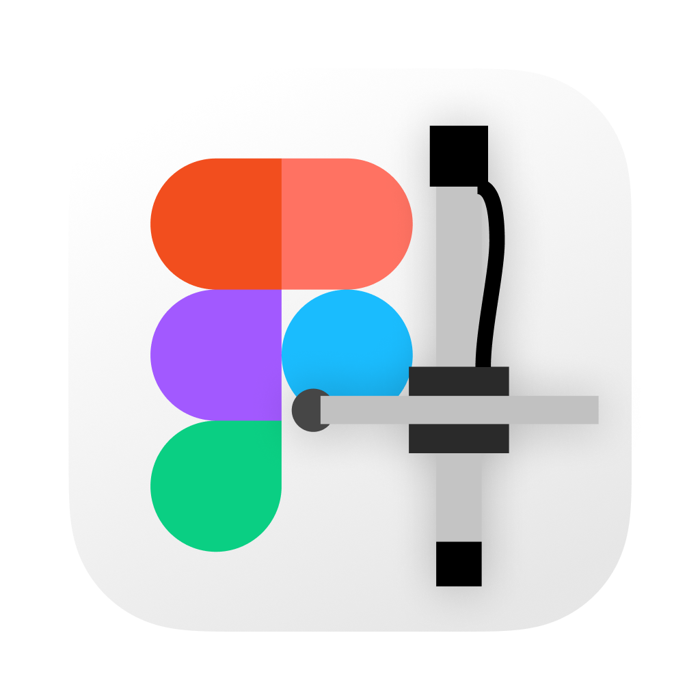

# AxiFigma - An AxiDraw and Figma mashup

This driver app aims to make working with the AxiDraw an effortless affair.

### Project structure

The project is structured into 3 parts

- driver/ contains the python script to expose the AxiDraw python api in a websocket
- ui/, the frontend code to control the plotter
- figma/ the plugin code for figma
- nuxt/ legacy code from MKI of this plugin